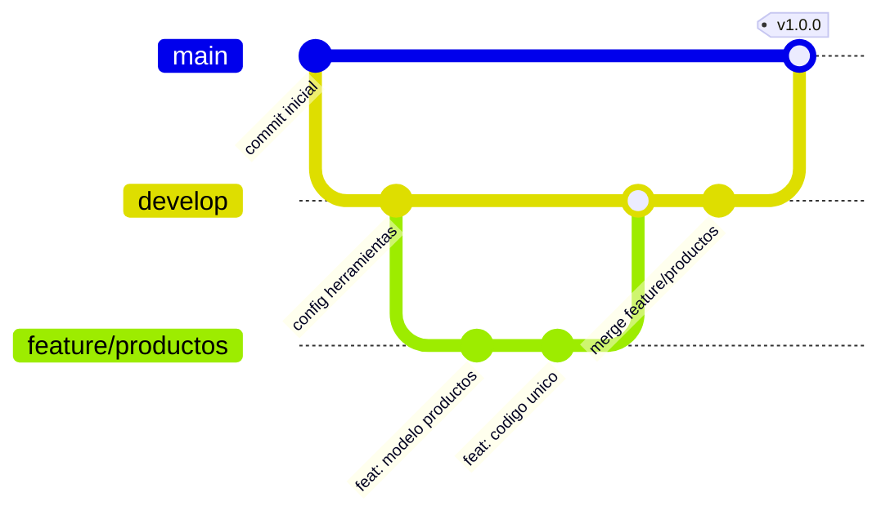

# Diagrama de flujo del trabajo con Git

El siguiente diagrama representa el flujo de trabajo que sigue el equipo para el control de versiones del Sistema de Control de Inventario.

```mermaid
gitGraph
   commit id: "commit inicial"
   branch develop
   checkout develop
   commit id: "config herramientas"
   branch feature/productos
   checkout feature/productos
   commit id: "feat: modelo productos"
   commit id: "feat: codigo unico"
   checkout develop
   merge feature/productos
   commit id: "merge feature/productos"
   checkout main
   merge develop tag: "v1.0.0"
```
